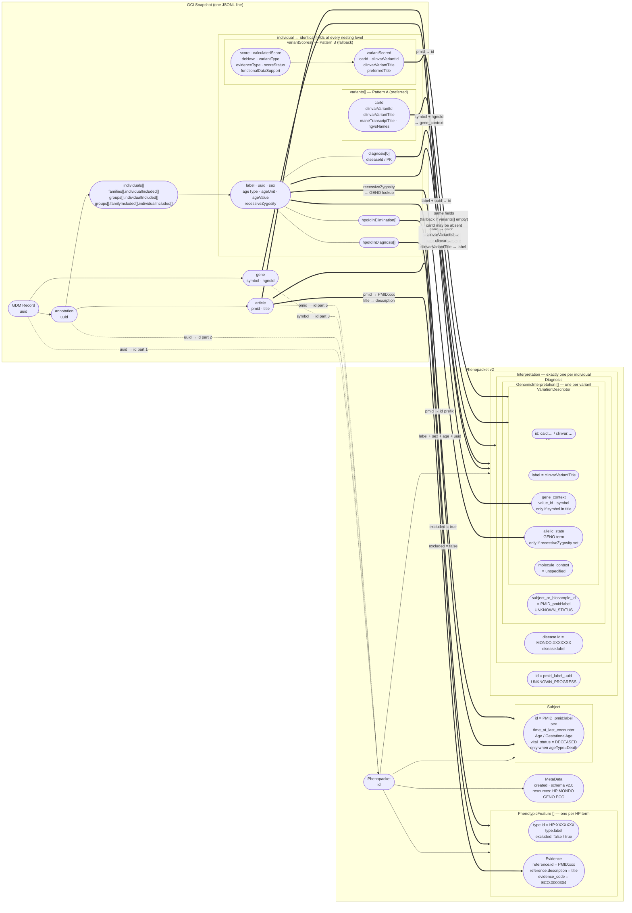

# GCI Snapshot → Phenopacket v2 Data Map

This document describes the full mapping from ClinGen GCI snapshot fields to GA4GH Phenopacket v2 fields, including individual nesting nuances.

---

## 1. GCI Snapshot Structure

Each line of the JSONL file is one **GDM record**. The nesting hierarchy is:

```
GDM record (uuid)
└── resourceParent.gdm
    ├── gene
    │   ├── symbol                   e.g. "DSG2"
    │   └── hgncId                  e.g. "HGNC:3049"
    └── annotations[]
        ├── uuid
        ├── article
        │   ├── pmid
        │   └── title
        ├── individuals[]            ← direct individuals  (tag: "individual")
        ├── families[]
        │   └── individualIncluded[] ← family individuals (tag: "family")
        └── groups[]
            ├── individualIncluded[] ← group individuals  (tag: "group")
            └── familyIncluded[]
                └── individualIncluded[] ← group-family individuals (tag: "group")
```

> **One phenopacket is produced per qualifying individual across all nesting levels.**
> The `tag` value (`individual` / `family` / `group`) is embedded in the phenopacket ID to show provenance.

---

## 2. Per-Individual GCI Fields

The per-individual field set is **identical at every nesting level** (direct, family, group). The only exception is `phaseStatus`, which appears only on direct individuals in practice.

| GCI Field | Type | Description |
|---|---|---|
| `label` | string | Display name / identifier (e.g. `"Proband A"`, `"II:3"`) |
| `uuid` | string | Unique identifier for this individual |
| `is_proband` | string | `"Yes"` or `"No"` (string, not boolean) — **not used as a filter** |
| `sex` | string | `"Male"`, `"Female"`, or anything else (mapped to `UNKNOWN_SEX`) |
| `ageType` | string | `"Onset"`, `"Death"`, `"Diagnosis"`, `"Report"` |
| `ageUnit` | string | `"Years"`, `"Months"`, `"Weeks"`, `"Days"`, `"Hours"`, `"Weeks gestation"` |
| `ageValue` | number | Numeric age (may be fractional, e.g. `38.5` for gestational weeks) |
| `hpoIdInDiagnosis` | string[] | HPO terms present in the individual (included phenotypes). Format: `"Label (HP:XXXXXXX)"` or plain `"HP:XXXXXXX"` |
| `hpoIdInElimination` | string[] | HPO terms absent/excluded in the individual |
| `recessiveZygosity` | string or null | `"Homozygous"`, `"Heterozygous"`, `"TwoTrans"`, `"Hemizygous"`, or `null` |
| `diagnosis[]` | array | Disease objects; **only the first entry is used** |
| `diagnosis[0].diseaseId` | string | `"MONDO_XXXXXXX"` or `"FREETEXT_..."` or empty |
| `diagnosis[0].PK` | string | Fallback disease key when `diseaseId` is absent |
| `variants[]` | array | Variant pattern A — full linked variant objects (see §3) |
| `variantScores[]` | array | Variant pattern B — scored variant wrappers (see §3) |
| `denovo` | string | Whether the individual's variant is de novo (not currently mapped) |
| `bothVariantsInTrans` | boolean | Relevant to compound-het phasing (not currently mapped) |
| `phaseStatus` | string | Phase status; observed on direct individuals only (not currently mapped) |
| `countryOfOrigin` | string | Country of origin (not currently mapped) |
| `ethnicity` | string | Ethnicity (not currently mapped) |
| `race` | string | Race (not currently mapped) |
| `additionalInformation` | string | Free-text notes (not currently mapped) |
| `otherPMIDs` | string[] | Additional PubMed references beyond the annotation article (not currently mapped) |

---

## 3. Variant Recording Patterns: `variants[]` vs `variantScores[]`

These two fields represent two different ways GCI recorded variant evidence. **Both patterns appear at every nesting level (direct, family, group)** — the choice is not determined by nesting; it reflects when and how the curation was done. An individual can have `variants[]` only, `variantScores[]` only, both, or neither.

### Distribution across the snapshot (full dataset)

| Nesting context | `variants[]` only | `variantScores[]` only | Both | Neither |
|---|---|---|---|---|
| Direct individuals | 4,227 (19%) | 16,093 (73%) | 1,605 (7%) | 401 (2%) |
| Family individuals | 2,355 (34%) | 3,745 (54%) | 788 (11%) | 179 (3%) |
| Group individuals | 1,067 (31%) | 1,934 (56%) | 427 (12%) | 48 (1%) |

> `variantScores[]` is actually the dominant pattern, including in direct individuals.

### Pattern A: `variants[]` — full linked variant object

Each entry in `variants[]` is a rich variant entity linked by reference in GCI:

| Field | Description |
|---|---|
| `carId` | ClinGen Allele Registry ID (preferred for `VariationDescriptor.id`) |
| `clinvarVariantId` | ClinVar variant ID (fallback for `VariationDescriptor.id`) |
| `clinvarVariantTitle` | Human-readable variant label — used as `VariationDescriptor.label` |
| `maneTranscriptTitle` | MANE select transcript title (not currently mapped) |
| `hgvsNames` | Dict of HGVS expressions keyed by genome build (not currently mapped) |
| `dbSNPIds` | dbSNP RS IDs (not currently mapped) |
| `molecularConsequenceList` | SO-term consequence list (not currently mapped) |
| `variationType` | Variant type string (not currently mapped) |
| `uuid` | Variant entity UUID |
| `@id`, `@type` | JSON-LD identity fields |
| `associatedPathogenicities` | Linked pathogenicity assessments |
| `clinVarRCVs`, `clinVarSCVs` | ClinVar record IDs |
| `status`, `date_created`, `last_modified` | Provenance metadata |

### Pattern B: `variantScores[]` — scored variant wrapper

Each entry in `variantScores[]` is a **scoring record** that wraps a variant. The scoring metadata lives at the top level; the variant itself is in `.variantScored`.

**Scoring wrapper fields (top-level of `variantScores[]` entry):**

| Field | Description |
|---|---|
| `variantScored` | The nested variant object (see below) |
| `score` | Curator-assigned score |
| `calculatedScore` | System-calculated score |
| `deNovo` | De novo status: `"Yes"`, `"No"`, `"Unknown"` |
| `variantType` | Variant classification in scoring context (e.g. `"OTHER_VARIANT_TYPE"`) |
| `evidenceType` | Evidence category (e.g. `"Individual"`) |
| `scoreStatus` | Score state: `"Score"`, `"Contradicts"`, etc. |
| `scoreExplanation` | Free-text explanation of the score |
| `functionalDataSupport` | Whether functional data supports pathogenicity (`"Yes"` / `"No"`) |
| `affiliation` | Curation group affiliation ID |
| `evidenceScored` | UUID of the evidence record being scored |
| `PK`, `item_type`, `date_created`, `last_modified` | Provenance metadata |

**`variantScores[].variantScored` fields (the actual variant):**

| Field | Notes vs Pattern A |
|---|---|
| `clinvarVariantId` | Same — used for `VariationDescriptor.id` fallback |
| `clinvarVariantTitle` | Same — used as `VariationDescriptor.label` |
| `carId` | Present in some records, absent in others (Pattern A always has it when available) |
| `preferredTitle` | **Only in Pattern B** — an updated/preferred transcript title; Pattern A uses `maneTranscriptTitle` instead |
| `hgvsNames` | Same structure as Pattern A |
| `dbSNPIds` | Same as Pattern A |
| `molecularConsequenceList` | Same as Pattern A |
| `variationType` | Same as Pattern A |
| `PK` | Internal database key; replaces Pattern A's `uuid` / `@id` |
| `item_type` | Always `"variant"` |
| `status`, `date_created`, `last_modified` | Same provenance fields |
| `@id`, `@type`, `uuid`, `variant_identifier` | **Absent in Pattern B** — these JSON-LD / entity fields only exist in Pattern A |

### How the pipeline handles both patterns

```
variants = individual.get("variants") or []
if not variants:                          # Pattern A preferred
    variants = [                          # Pattern B fallback
        vs["variantScored"]
        for vs in (individual.get("variantScores") or [])
        if vs.get("variantScored")
    ]
```

When both are present, `variants[]` wins. When only `variantScores[]` exists, `.variantScored` is extracted and treated as a variant object. **The scoring wrapper fields (`score`, `deNovo`, `variantType`, etc.) are not currently mapped** — only the inner `.variantScored` variant is used.

---

## 4. Individual Nesting: Tag Differences

The three nesting paths produce the same per-individual field set, but differ in where the individual sits in the GCI record and in the `tag` embedded in the phenopacket ID:

| Nesting path | Tag value | GCI path |
|---|---|---|
| Direct individual | `individual` | `annotation.individuals[]` |
| Inside a family | `family` | `annotation.families[].individualIncluded[]` |
| Inside a group (direct) | `group` | `annotation.groups[].individualIncluded[]` |
| Inside a group's family | `group` | `annotation.groups[].familyIncluded[].individualIncluded[]` |

Both group-level paths get the same `group` tag because the pipeline treats the group as the aggregation unit; distinguishing group-direct vs. group-family is not preserved beyond the tag.

**Filtering rule:** An individual is included regardless of `is_proband` status, but **must** have at least one non-empty HPO list (`hpoIdInDiagnosis` or `hpoIdInElimination`). Individuals with no HPO terms are silently skipped.

---

## 4. Field-by-Field Mapping: GCI → Phenopacket v2

### 4.1 Phenopacket (top-level)

| Phenopacket field | Source GCI field(s) | Transformation |
|---|---|---|
| `id` | `record.uuid`, `annotation.uuid`, `gene.symbol`, disease ID, `annotation.article.pmid`, `individual.label`, nesting tag | `{record_uuid}_{annotation_uuid}_{gene_symbol}_{mondo_id_underscored}_{pmid}_{label_sanitized}_{tag}` |
| `meta_data.created` | — | Current UTC timestamp at run time |
| `meta_data.phenopacket_schema_version` | — | Hardcoded `"2.0"` |
| `meta_data.resources` | — | Four fixed entries: HP, Mondo, GENO, ECO (see §5) |

**ID construction rules:**
- `label_sanitized`: spaces → `_`, colons → `-` (e.g. `"II:3"` → `"II-3"`)
- `mondo_id_underscored`: colon form with `:` replaced by `_` (e.g. `"MONDO_0016587"`)
- Output filename: `{phenopacket_id}.json`

---

### 4.2 Subject (`subject: Individual`)

| Phenopacket field | Source GCI field | Transformation |
|---|---|---|
| `subject.id` | `annotation.article.pmid`, `individual.label` | `"PMID_{pmid}:{label}"` (unsanitized label) |
| `subject.sex` | `individual.sex` | `"Male"` → `MALE`; `"Female"` → `FEMALE`; anything else → `UNKNOWN_SEX` |
| `subject.time_at_last_encounter` | `individual.ageValue`, `individual.ageUnit` | ISO 8601 duration (see §6.1); omitted if either is missing/unrecognized |
| `subject.vital_status.status` | `individual.ageType` | Set to `DECEASED` only when `ageType == "Death"`; omitted entirely otherwise |

---

### 4.3 Phenotypic Features (`phenotypic_features[]: PhenotypicFeature`)

One `PhenotypicFeature` is produced per HPO term. Diagnosis terms come first, then elimination terms.

| Phenopacket field | Source GCI field | Transformation |
|---|---|---|
| `type.id` | `individual.hpoIdInDiagnosis[]` or `individual.hpoIdInElimination[]` | Strip label prefix: extract `HP:XXXXXXX` from `"Label (HP:XXXXXXX)"` |
| `type.label` | — | Looked up via OntologyManager from the HP ontology |
| `excluded` | Which list the term came from | `False` for `hpoIdInDiagnosis`; `True` for `hpoIdInElimination` |
| `evidence[0].reference.id` | `annotation.article.pmid` | `"PMID:{pmid}"` |
| `evidence[0].reference.description` | `annotation.article.title` | Used as-is |
| `evidence[0].evidence_code.id` | — | Hardcoded `"ECO:0000304"` |
| `evidence[0].evidence_code.label` | — | Hardcoded `"author statement supported by traceable reference used in manual assertion"` |

---

### 4.4 Interpretation (`interpretations[0]: Interpretation`)

Exactly one `Interpretation` is produced per individual; all variant interpretations for that individual are collected into its `diagnosis.genomic_interpretations`.

| Phenopacket field | Source GCI field | Transformation |
|---|---|---|
| `interpretations[0].id` | `annotation.article.pmid`, `individual.label`, `individual.uuid` | `"{pmid}_{label_sanitized}_{uuid}"` |
| `interpretations[0].progress_status` | — | Hardcoded `UNKNOWN_PROGRESS` |

---

### 4.5 Diagnosis (`interpretations[0].diagnosis: Diagnosis`)

| Phenopacket field | Source GCI field | Transformation |
|---|---|---|
| `diagnosis.disease.id` | `individual.diagnosis[0].diseaseId` (or `.PK` as fallback) | `"MONDO_XXXXXXX"` → `"MONDO:XXXXXXX"`; `FREETEXT_*` or empty → `"MONDO:0700096"` |
| `diagnosis.disease.label` | — | Looked up via OntologyManager from the Mondo ontology; falls back to `"human disease"` |

**Disease ID resolution priority:**
1. `diagnosis[0].diseaseId` — used if present and non-empty
2. `diagnosis[0].PK` — used if `diseaseId` absent
3. `MONDO:0700096` ("human disease") — fallback for `FREETEXT_*`, empty string, or missing `diagnosis[]`

---

### 4.6 Genomic Interpretations (`diagnosis.genomic_interpretations[]: GenomicInterpretation`)

One `GenomicInterpretation` per variant. Variant source priority: `individual.variants[]` preferred; if empty, falls back to `individual.variantScores[].variantScored`.

| Phenopacket field | Source GCI field | Transformation |
|---|---|---|
| `subject_or_biosample_id` | `annotation.article.pmid`, `individual.label` | `"PMID_{pmid}:{label}"` — same as `subject.id` |
| `interpretation_status` | — | Hardcoded `UNKNOWN_STATUS` |
| `variant_interpretation.acmg_pathogenicity_classification` | — | Hardcoded `NOT_PROVIDED` |
| `variant_interpretation.therapeutic_actionability` | — | Hardcoded `UNKNOWN_ACTIONABILITY` |

**VariationDescriptor fields** — `variant` below refers to a `variants[]` entry (Pattern A) or a `variantScores[].variantScored` object (Pattern B); the same fields are read in both cases:

| Phenopacket field | Source GCI field | Notes |
|---|---|---|
| `variation_descriptor.id` | `variant.carId` → `"caid:{carId}"`, else `variant.clinvarVariantId` → `"clinvar:{id}"` | Pattern B `.variantScored` sometimes lacks `carId`; falls through to ClinVar ID |
| `variation_descriptor.label` | `variant.clinvarVariantTitle` | Both patterns have this field. Pattern B also has `preferredTitle` (newer transcript), but that is **not currently mapped** |
| `variation_descriptor.molecule_context` | — | Hardcoded `unspecified_molecule_context` |
| `variation_descriptor.gene_context.value_id` | `gene.hgncId` | Set only when `gene.symbol` appears in `clinvarVariantTitle` |
| `variation_descriptor.gene_context.symbol` | `gene.symbol` | Set only when gene symbol appears in title (same condition) |
| `variation_descriptor.allelic_state.id` | `individual.recessiveZygosity` | Mapped via GENO lookup (see §6.2); omitted when `recessiveZygosity` is `null` |
| `variation_descriptor.allelic_state.label` | `individual.recessiveZygosity` | Mapped via GENO lookup |

> `gene_context` is omitted entirely when the gene symbol is absent from `clinvarVariantTitle` — this guards against attributing a variant to the wrong gene when titles don't match.

---

## 5. Fixed/Hardcoded Values

### 5.1 MetaData Resources (always the same 4 entries)

| Resource id | Name | Namespace prefix | URL |
|---|---|---|---|
| `hp` | Human Phenotype Ontology | `HP` | `http://purl.obolibrary.org/obo/hp.owl` |
| `mondo` | Mondo Disease Ontology | `MONDO` | `http://purl.obolibrary.org/obo/mondo.owl` |
| `geno` | Genotype Ontology | `GENO` | `http://purl.obolibrary.org/obo/geno.owl` |
| `eco` | Evidence and Conclusion Ontology | `ECO` | `https://evidenceontology.org/repo/ECO.owl` |

---

## 6. Enum and Conversion Tables

### 6.1 Age Unit → ISO 8601 Duration

| `ageUnit` value | ISO 8601 format | Phenopacket field |
|---|---|---|
| `"Years"` | `P{n}Y` | `time_at_last_encounter.age.iso8601duration` |
| `"Months"` | `P{n}M` | `time_at_last_encounter.age.iso8601duration` |
| `"Weeks"` | `P{n}W` | `time_at_last_encounter.age.iso8601duration` |
| `"Days"` | `P{n}D` | `time_at_last_encounter.age.iso8601duration` |
| `"Hours"` | `PT{n}H` | `time_at_last_encounter.age.iso8601duration` |
| `"Weeks gestation"` | weeks + days | `time_at_last_encounter.gestational_age.{weeks, days}` |
| missing / unrecognized | — | field omitted; warning logged |

Fractional `ageValue` with `"Weeks gestation"`: `weeks = floor(ageValue)`, `days = round(frac * 7)`.
All other units: `ageValue` is truncated to int.

### 6.2 Zygosity → GENO Term

| `recessiveZygosity` (case-insensitive) | GENO ID | GENO label |
|---|---|---|
| `"homozygous"` | `GENO:0000136` | homozygous |
| `"heterozygous"` | `GENO:0000135` | heterozygous |
| `"twotrans"` | `GENO:0000402` | compound heterozygous |
| `"hemizygous"` | `GENO:0000134` | hemizygous |
| `null` | *(omitted)* | `allelic_state` field not set |
| anything else | `GENO:0000137` | unspecified zygosity + warning logged |

### 6.3 Sex Mapping

| `sex` value (case-insensitive) | Phenopacket enum |
|---|---|
| `"male"` | `Sex.MALE` |
| `"female"` | `Sex.FEMALE` |
| anything else (including absent) | `Sex.UNKNOWN_SEX` |

### 6.4 Vital Status

| `ageType` value | `vital_status.status` |
|---|---|
| `"Death"` | `VitalStatus.Status.DECEASED` |
| anything else | field omitted entirely |

---

## 7. Entity Mapping Diagram



---

## 8. Complete Structural Overview

```
GCI JSONL record
│
├── uuid ──────────────────────────────────────────────→ Phenopacket.id (part 1)
└── resourceParent.gdm
    ├── gene.symbol ──────────────────────────────────→ Phenopacket.id (part 3)
    │                                                  → VariationDescriptor.gene_context.symbol (conditional)
    ├── gene.hgncId ──────────────────────────────────→ VariationDescriptor.gene_context.value_id (conditional)
    └── annotations[]
        ├── uuid ────────────────────────────────────→ Phenopacket.id (part 2)
        ├── article.pmid ────────────────────────────→ Phenopacket.id (part 5)
        │                                             → Subject.id (prefix)
        │                                             → GenomicInterpretation.subject_or_biosample_id
        │                                             → Interpretation.id (part 1)
        │                                             → Evidence.reference.id
        ├── article.title ───────────────────────────→ Evidence.reference.description
        │
        ├── individuals[] ─────────────────────────────────────────── tag: "individual"
        ├── families[].individualIncluded[] ───────────────────────── tag: "family"
        └── groups[]
            ├── individualIncluded[] ─────────────────────────────── tag: "group"
            └── familyIncluded[].individualIncluded[] ────────────── tag: "group"
                           │
                           ↓  (per individual — same fields at every nesting level)
                       individual
                           ├── label ──────────────────────────────→ Subject.id (suffix, unsanitized)
                           │                                         → Phenopacket.id (part 6, sanitized)
                           │                                         → Interpretation.id (part 2, sanitized)
                           ├── uuid ───────────────────────────────→ Interpretation.id (part 3)
                           ├── sex ────────────────────────────────→ Subject.sex
                           ├── ageType ─────────────────────────────→ Subject.vital_status (if "Death")
                           ├── ageUnit + ageValue ─────────────────→ Subject.time_at_last_encounter
                           ├── hpoIdInDiagnosis[] ─────────────────→ PhenotypicFeature (excluded=False)
                           ├── hpoIdInElimination[] ───────────────→ PhenotypicFeature (excluded=True)
                           ├── diagnosis[0].diseaseId / .PK ───────→ Diagnosis.disease.id + .label
                           ├── recessiveZygosity ──────────────────→ VariationDescriptor.allelic_state
                           ├── variants[] ─────────── [Pattern A, preferred] ──→ GenomicInterpretation
                           │   ├── carId ─────────────────────────────────────→ VariationDescriptor.id ("caid:")
                           │   ├── clinvarVariantId ───────────────────────────→ VariationDescriptor.id ("clinvar:", fallback)
                           │   ├── clinvarVariantTitle ────────────────────────→ VariationDescriptor.label
                           │   ├── maneTranscriptTitle ────────────────────────→ (not mapped)
                           │   ├── hgvsNames, dbSNPIds, molecularConsequenceList → (not mapped)
                           │   └── uuid, @id, @type, variant_identifier ────────→ (not mapped)
                           └── variantScores[] ──── [Pattern B, fallback] ────→ GenomicInterpretation
                               ├── score, calculatedScore ──────────────────────→ (not mapped)
                               ├── deNovo, variantType, evidenceType ─────────→ (not mapped)
                               ├── scoreStatus, scoreExplanation ─────────────→ (not mapped)
                               ├── functionalDataSupport, affiliation ─────────→ (not mapped)
                               └── variantScored (the inner variant)
                                   ├── carId ────────────────────────────────→ VariationDescriptor.id ("caid:", if present)
                                   ├── clinvarVariantId ──────────────────────→ VariationDescriptor.id ("clinvar:", fallback)
                                   ├── clinvarVariantTitle ───────────────────→ VariationDescriptor.label
                                   ├── preferredTitle ────────────────────────→ (not mapped — Pattern B only)
                                   └── hgvsNames, dbSNPIds, molecularConsequenceList → (not mapped)
```

---

## 8. Fields with No GCI Source (always hardcoded)

| Phenopacket field | Hardcoded value |
|---|---|
| `meta_data.phenopacket_schema_version` | `"2.0"` |
| `meta_data.created` | current UTC timestamp |
| `evidence[0].evidence_code.id` | `"ECO:0000304"` |
| `evidence[0].evidence_code.label` | `"author statement supported by traceable reference used in manual assertion"` |
| `interpretations[0].progress_status` | `UNKNOWN_PROGRESS` |
| `interpretation_status` | `UNKNOWN_STATUS` |
| `acmg_pathogenicity_classification` | `NOT_PROVIDED` |
| `therapeutic_actionability` | `UNKNOWN_ACTIONABILITY` |
| `molecule_context` | `unspecified_molecule_context` |
| fallback `disease.id` | `"MONDO:0700096"` |
| fallback `disease.label` | `"human disease"` |

---

## 9. Fields Read from GCI But Not Mapped

These GCI fields exist in the data but are not currently mapped to any Phenopacket field.

**Per-individual fields (all nesting levels):**

| GCI field | Notes |
|---|---|
| `individual.is_proband` | Filter was relaxed to HPO-presence only; value is ignored |
| `individual.ageType` (non-Death values) | `"Onset"`, `"Diagnosis"`, `"Report"` are not mapped to any Phenopacket distinction — only `"Death"` is acted on |
| `individual.denovo` | De novo status at the individual level (distinct from `variantScores[].deNovo`) |
| `individual.bothVariantsInTrans` | Phase information for compound-het variants |
| `individual.phaseStatus` | Phase status field; only appears on direct individuals in practice |
| `individual.countryOfOrigin` | Demographic field |
| `individual.ethnicity` | Demographic field |
| `individual.race` | Demographic field |
| `individual.additionalInformation` | Free-text clinical notes |
| `individual.otherPMIDs` | Additional PubMed references beyond the annotation article |
| `individual.termsInDiagnosis` | May hold free-text diagnostic terms (distinct from `hpoIdInDiagnosis`) |
| `individual.termsInElimination` | May hold free-text elimination terms (distinct from `hpoIdInElimination`) |
| `individual.scores` | Individual-level scoring object (distinct from `variantScores`) |
| `individual.method` | Methodology description |

**Pattern A `variants[]` fields not mapped:**

| GCI field | Notes |
|---|---|
| `variants[].maneTranscriptTitle` | Updated MANE-select transcript title; Pattern B has `preferredTitle` for the same purpose |
| `variants[].hgvsNames` | Dict of HGVS expressions by genome build (e.g. `GRCh38`) |
| `variants[].dbSNPIds` | dbSNP RS identifiers |
| `variants[].molecularConsequenceList` | SO-term consequence list with HGVS |
| `variants[].variationType` | Variant type classification |
| `variants[].uuid`, `@id`, `@type` | Variant entity identity — not needed for Phenopacket output |

**Pattern B `variantScores[]` wrapper fields not mapped:**

| GCI field | Notes |
|---|---|
| `variantScores[].score` | Curator-assigned score |
| `variantScores[].calculatedScore` | System-calculated score |
| `variantScores[].deNovo` | De novo status from scoring context: `"Yes"`, `"No"`, `"Unknown"` |
| `variantScores[].variantType` | Variant type classification in scoring context |
| `variantScores[].evidenceType` | Evidence category |
| `variantScores[].scoreStatus` | Score state: `"Score"`, `"Contradicts"`, etc. |
| `variantScores[].scoreExplanation` | Free-text explanation |
| `variantScores[].functionalDataSupport` | Whether functional evidence supports pathogenicity |
| `variantScores[].affiliation` | Curation group affiliation ID |
| `variantScores[].variantScored.preferredTitle` | Updated preferred transcript title (Pattern B only; Pattern A has `maneTranscriptTitle` instead) |

**Annotation / container-level fields not mapped:**

| GCI field | Notes |
|---|---|
| `annotation.article.*` (beyond pmid/title) | Other article metadata not used |
| `family.*` container-level fields | Only `individualIncluded` is traversed; family-level metadata not captured |
| `group.*` container-level fields | Only `individualIncluded` and `familyIncluded` traversed; group-level metadata not captured |